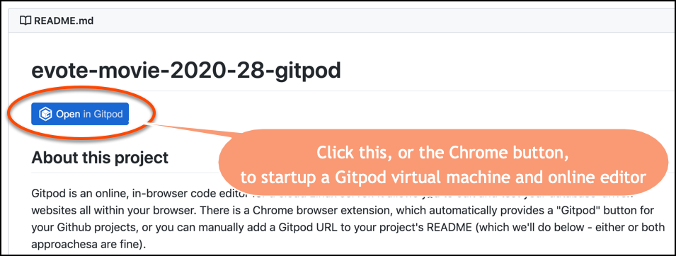
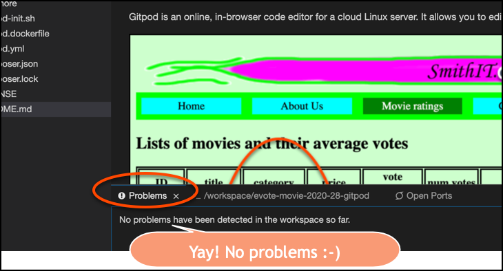
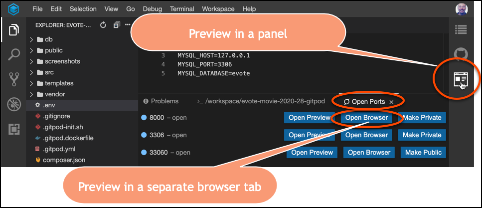

# evote-movie-2020-28-gitpod

[](https://gitpod.io/#https://github.com/dr-matt-smith/evote-movie-2020-28-gitpod)

## About this project

Gitpod is an online, in-browser code editor for a cloud Linux server. It allows you to edit and test your database-driven websites all within your browser. 


There is a Chrome browser extension, which automatically provides a "Gitpod" button for your Github projects, or you can manually add a Gitpod URL to your project's README (which we'll do below - either or both approachesa are fine).


- add a Gitpod link to the top of your `README.md` file. Add the following code:

    ```markdown
    [](https://gitpod.io/#https://github.com/dr-matt-smith/evote-movie-2020-28-gitpod)
    ```

    - the general form of this Gitpod link is as follows:
    
    ```markdown
    [](https://gitpod.io/#AAA)
    ```
  
    - where you replace `AAA` with the URI for your Github project, e.g. `https://github.com/dr-matt-smith/evote-movie-2020-28-gitpod`
    
- create a Gitpod configuration file `.gitpod.yml`.

```yaml
    image:
      file: .gitpod.dockerfile
    
    ports:
      - port: 8000
        onOpen: ignore
      - port: 3306
        onOpen: ignore
    
    tasks:
      - init: bash .gitpod-init.sh
        command: php -S localhost:8000 -t public
```

    -  This tells Gitpod to:
    
        - open the Docker image specified in file `.gitpod.dockerfile`
        
        - to not register errors when port 8000 (for web server) and 3306 (for MySQL server) are opened when the Linux virtual machine is setup

        - to run the CLI commands in file `.gitpod-init.sh`
        
        - finally, to run the built-in  PHP webserver, with directory `public` as the website root 
       
       
-  create the Docker file `.gitpod.dockerfile` containing:

```dockerfile
    FROM gitpod/workspace-mysql
```

    - this simply says to use the Docker image from Gitpon that is Linux + MySQL
    
- create the Bash shell command file `.gitpod-init.sh`:

    ```bash
        composer install
        mysql -e "ALTER USER 'root'@'localhost' IDENTIFIED WITH mysql_native_password by 'passpass'"
        php db/resetDatabase.php
    ```

    - this runs the Composer `install` command, populating the `/vendor` directory with 3rd-party libraries listed in `composer.json`
    
    - then resets the MySQL `root` password to `passpass`, using the native password method, so MySQL can be communicated to by PHP
    
    - finally, the `db/resetDatabase.php` script is executed, which should result in the database, tables, and table data being created
    
- commit and push the changes to Github    

- you can now open the Github rep:




- the Gitpod environment should then startup - it may take a minute or two to start the VM, initialise the environment, run the startup scripts, and open the editor


- the Gitpod environemt looks like this:


- check there were no errors ('Problems'):



- open the project a web browser 



---

## Pushing changes to Github repo

If you make changes to files in your Gitpod Workspace, they will not automatically update your Github repostory.

To commit and push changes to Github, use the Git tools:


